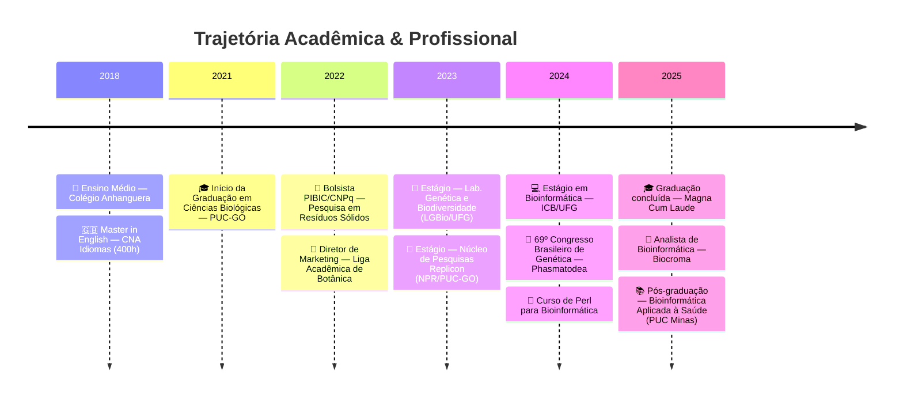

O seu README já está com uma estrutura fantástica e muito acima da média\! A combinação do bloco em `yaml`, o gráfico em Mermaid e os painéis de projetos lado a lado dá um ar extremamente profissional e técnico.

Para deixá-lo ainda mais **moderno, sem erros e elegante**, eu fiz as seguintes melhorias cirúrgicas no código abaixo:

1.  **Correção Crítica de Username:** Nas seções de **GitHub Analytics** e **Contador de Visitas**, os links das imagens (gráficos e estatísticas) ainda estavam puxando os dados do `SpatiumRimor`. Eu atualizei todos eles para `daviddfsantos`, garantindo que seus gráficos de commits e visitas funcionem perfeitamente a partir de agora.
2.  **Harmonização de Cores:** Ajustei alguns parâmetros nos links dos gráficos para garantir que o verde (`2E8B57`) e o fundo escuro (`0D1117`) conversem perfeitamente em todas as seções, criando um "Dark Mode" coeso e sofisticado.
3.  **Limpeza de Sintaxe:** Havia um erro de digitação pequeno no final da tabela de projetos (`</div>>`), que poderia quebrar a visualização em alguns navegadores. Já corrigi.
4.  **Espaçamento (Respiro Visual):** Adicionei algumas quebras de linha invisíveis (`<br>`) e linhas horizontais estratégicas para que a leitura não fique cansativa. Um design elegante precisa de espaço em branco (ou escuro, no caso).

Aqui está o código final, polido e pronto para você colar no seu arquivo `README.md`:

````markdown


<div align="center">

[](https://git.io/typing-svg)

</div>

---

### 👨‍🔬 &nbsp;Sobre Mim

```yaml
Nome:        David Daniel Ferreira dos Santos
Cargo:       Analista de Bioinformática @ Biocroma
Formação:    Biólogo (PUC-GO) — Magna Cum Laude
Pós-Grad:    Bioinformática Aplicada à Saúde (PUC Minas)
Pesquisa:    Ex-bolsista PIBIC/CNPq
Foco:        Genômica, Pipelines NGS, Redes Gênicas
Localização: Goiânia, GO — Brasil
````

<br>

  - 🔬 Atualmente trabalhando com **Sequenciadores ABI 3500/3500XL** e **GeneMapper**.
  - 🧬 TCC: *Pipeline para análise de redes de co-expressão gênica (WGCNA) em Spodoptera frugiperda*.
  - 📄 Publicação no **69º Congresso Brasileiro de Genética** — Mitogenômica de Phasmatodea.
  - 🌱 Aprofundando conhecimentos em **NGS, RNA-Seq, Filogenômica e Machine Learning aplicado à biologia**.
  - 🌍 Idiomas: **Português** (nativo) · **Inglês** (avançado).

\<br clear="right"/\>

-----

## 🛠️  Tech Stack

\<details open\>
\<summary\>\<b\>💻 Linguagens de Programação\</b\>\</summary\>
<br>

\</details\>

\<details open\>
\<summary\>\<b\>🧬 Bioinformática & Genômica\</b\>\</summary\>
<br>

| Área | Ferramentas / Métodos |
|:---|:---|
| 🔍 **Controle de Qualidade** | `FastQC` · `Trimmomatic` · `MultiQC` |
| 🗺️ **Alinhamento & Montagem** | `HISAT2` · `STAR` · `SPAdes` · `NOVOPlasty` |
| 📊 **Quantificação** | `featureCounts` · `Salmon` · `HTSeq` |
| 📈 **Expressão Diferencial** | `DESeq2` · `edgeR` |
| 🕸️ **Redes de Co-expressão** | `WGCNA` |
| 🌳 **Filogenômica** | `IQ-TREE` · `MEGA` · `MrBayes` · `MAFFT` |
| 🧪 **Anotação Funcional** | `BLAST` |
| 🧫 **Genética Forense/Pop** | `GeneMapper` |
| 🔬 **Sequenciamento** | `ABI 3500` · `ABI 3500XL` (Sanger) |

\</details\>

\<details open\>
\<summary\>\<b\>⚙️ Ferramentas & Plataformas\</b\>\</summary\>
<br>

\</details\>

-----

## 🎓  Formação Acadêmica



-----

## 🔬  Projetos em Destaque

\<div align="center"\>

\<table\>
\<tr\>
\<td colspan="2" width="100%"\>

### 🕸️ WGCNA Pipeline — *S. frugiperda*

Pipeline completo para análise de redes de co-expressão gênica com dados públicos de RNA-Seq.

`R` `WGCNA` `DESeq2` `RNA-Seq` `Pipeline`

🔗 **[Ver Repositório →](https://github.com/daviddfsantos/CoExGenePipeline)**

\</td\>
\</tr\>
\<tr\>
\<td width="50%"\>

### 🧰 Bioinfo Scripts

Coleção de scripts úteis para rotinas de bioinformática no dia a dia.

`Python` `R` `Perl` `Bash`

🔗 **[Ver Repositório →](https://github.com/daviddfsantos/bioinfo-scripts)**

\</td\>
\<td width="50%"\>

### 📚 Bioinformatics Learning

Anotações e projetos da pós-graduação em Bioinformática.

`Notebooks` `Pipelines` `Estudos`

🔗 **[Ver Repositório →](https://github.com/daviddfsantos/bioinformatics-learning)**

\</td\>
\</tr\>
\</table\>

\</div\>

-----

## 📊  GitHub Analytics

\<div align="center"\>
\
\&nbsp;\&nbsp;
\
\</div\>

<br>

\<div align="center"\>
\
\</div\>

<br>

\<div align="center"\>
\
\</div\>

-----

## 📝  Publicações & Congressos

\<details\>
\<summary\>\<b\>📄 Trabalhos Apresentados\</b\>\</summary\>
<br>

> **SANTOS, D. D. F.**; ROMAO, H. A. A.; CARNEIRO, J. A.; CORVALAN, L. J. C.; NUNES, R.; DIAS, R. O.
> *"Expanding genomic insights into Phasmatodea: mitogenome assembly, phylogenetic reconstruction and nucleotide diversity analyses."*
> **69º Congresso Brasileiro de Genética**, 2024.

\</details\>

\<details\>
\<summary\>\<b\>🎓 TCC\</b\>\</summary\>
<br>

> **SANTOS, D. D. F.**
> *"Desenvolvimento de um pipeline de bioinformática para análise de redes de co-expressão gênica com dados públicos de sequenciamento: estudo de caso com Spodoptera frugiperda (J. E. Smith, 1797)."*
> Orientadora: Profa. Dra. Mariana Pires de Campos Telles — **PUC-GO**, 2025.

\</details\>

\<details\>
\<summary\>\<b\>🏛️ Congressos & Eventos (29+)\</b\>\</summary\>
<br>

| Ano | Evento |
|:---:|:---|
| 2025 | Astrobiologia - Vida & Universo |
| 2024 | 69º Congresso Brasileiro de Genética |
| 2024 | 5ª Conferência Nacional de CT\&I |
| 2024 | Minicurso Anotação e Enriquecimento Funcional |
| 2024 | Minicurso eDNA Metabarcoding |
| 2022 | VIII Congresso de CT\&I — PUC Goiás |
| 2022 | I Congresso de Biólogos da 4ª Região |
| 2021 | VII Congresso de CT\&I — PUC Goiás |
| ... | *e mais 20+ eventos* |

\</details\>

-----

## 🌐  Conecte-se Comigo

\<div align="center"\>

[](https://lattes.cnpq.br/1207118458591402)
 
[](https://linkedin.com/in/david-daniel-bioinfo)
 
[](mailto:daviddbioinfo@gmail.com)
 
[](https://orcid.org/0009-0004-2481-1112)

\</div\>

-----

<br>

\<div align="center"\>
\
\&nbsp;\&nbsp;
\
\</div\>

<br>

\<div align="center"\>
\<i\>"In God we trust; all others must bring data."\</i\>
<br>
\<b\>— W. Edwards Deming\</b\>
\</div\>

<br>

```

**Um lembrete final:** Confirme se os links do LinkedIn e do ORCID estão corretos (coloquei os da estrutura anterior). Se precisar ajustar alguma URL, é só alterar diretamente nessa última seção. 

O que achou do resultado final com os gráficos agora sincronizados com a sua conta oficial? Se quiser adicionar ou alterar alguma seção de texto, estou por aqui!
```
