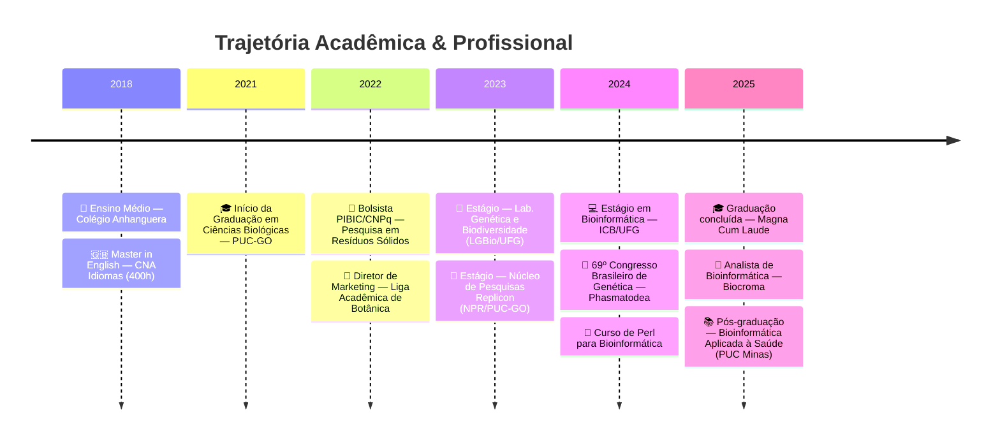

<div align="center">

[](https://git.io/typing-svg)

</div>

---

### 👨‍🔬 &nbsp;Sobre Mim

```yaml
Nome:       David Daniel Ferreira dos Santos
Cargo:      Analista de Bioinformática @ Biocroma
Formação:   Biólogo (PUC-GO) — Magna Cum Laude
Pós-Grad:   Bioinformática Aplicada à Saúde (PUC Minas)
Pesquisa:   Ex-bolsista PIBIC/CNPq
Foco:       Genômica, Pipelines NGS, Redes Gênicas
Localização: Goiânia, GO — Brasil
```

<br>

- 🔬 Atualmente trabalhando com **Sequenciadores ABI 3500/3500XL** e **GeneMapper**
- 🧬 TCC: *Pipeline para análise de redes de co-expressão gênica (WGCNA) em Spodoptera frugiperda*
- 📄 Publicação no **69º Congresso Brasileiro de Genética** — Mitogenômica de Phasmatodea
- 🌱 Aprofundando conhecimentos em **NGS, RNA-Seq, Filogenômica e Machine Learning aplicado à biologia**
- 🌍 Idiomas: **Português** (nativo) · **Inglês** (avançado)

<br clear="right"/>

---

## 🛠️ &nbsp;Tech Stack

<details open>
<summary><b>💻 Linguagens de Programação</b></summary>
<br>


</details>

<details open>
<summary><b>🧬 Bioinformática & Genômica</b></summary>
<br>

| Área | Ferramentas / Métodos |
|:---|:---|
| 🔍 Controle de Qualidade | `FastQC` · `Trimmomatic` · `MultiQC` |
| 🗺️ Alinhamento & Montagem | `HISAT2` · `STAR` · `SPAdes` · `NOVOPlasty` |
| 📊 Quantificação | `featureCounts` · `Salmon` · `HTSeq` |
| 📈 Expressão Diferencial | `DESeq2` · `edgeR` |
| 🕸️ Redes de Co-expressão | `WGCNA` |
| 🌳 Filogenômica | `IQ-TREE` · `MEGA` · `MrBayes` · `MAFFT` |
| 🧪 Anotação Funcional | `BLAST`|
| 🧫 Genética Forense/Pop | `GeneMapper` |
| 🔬 Sequenciamento | `ABI 3500` · `ABI 3500XL` (Sanger) |

</details>

<details open>
<summary><b>⚙️ Ferramentas & Plataformas</b></summary>
<br>


</details>

---

## 🎓 &nbsp;Formação Acadêmica



---

## 🔬 &nbsp;Projetos em Destaque

<div align="center">

<table>
<tr>
<td width="50%">

### 🕸️ WGCNA Pipeline — *S. frugiperda*
Pipeline completo para análise de redes de co-expressão gênica com dados públicos de RNA-Seq.

`R` `WGCNA` `DESeq2` `RNA-Seq` `Pipeline`

🔗 **[Ver Repositório →](https://github.com/daviddfsantos/CoExGenePipeline)**

</td>

</tr>
<tr>
<td width="50%">

### 🧰 Bioinfo Scripts
Coleção de scripts úteis para rotinas de bioinformática no dia a dia.

`Python` `R` `Perl` `Bash`

🔗 **[Ver Repositório →](https://github.com/SpatiumRimor/bioinfo-scripts)**

</td>
<td width="50%">

### 📚 Bioinformatics Learning
Anotações e projetos da pós-graduação em Bioinformática.

`Notebooks` `Pipelines` `Estudos`

🔗 **[Ver Repositório →](https://github.com/SpatiumRimor/bioinformatics-learning)**

</td>
</tr>
</table>

</div>

---

## 📊 &nbsp;GitHub Analytics

<div align="center">
  
  &nbsp;&nbsp;
  
</div>

<br>

<div align="center">
  
</div>

<br>

<div align="center">
  
</div>

---

## 📝 &nbsp;Publicações & Congressos

<details>
<summary><b>📄 Trabalhos Apresentados</b></summary>
<br>

> **SANTOS, D. D. F.**; ROMAO, H. A. A.; CARNEIRO, J. A.; CORVALAN, L. J. C.; NUNES, R.; DIAS, R. O.
> *"Expanding genomic insights into Phasmatodea: mitogenome assembly, phylogenetic reconstruction and nucleotide diversity analyses."*
> **69º Congresso Brasileiro de Genética**, 2024.

</details>

<details>
<summary><b>🎓 TCC</b></summary>
<br>

> **SANTOS, D. D. F.**
> *"Desenvolvimento de um pipeline de bioinformática para análise de redes de co-expressão gênica com dados públicos de sequenciamento: estudo de caso com Spodoptera frugiperda (J. E. Smith, 1797)."*
> Orientadora: Profa. Dra. Mariana Pires de Campos Telles — **PUC-GO**, 2025.

</details>

<details>
<summary><b>🏛️ Congressos & Eventos (29+)</b></summary>
<br>

| Ano | Evento |
|:---:|:---|
| 2025 | Astrobiologia - Vida & Universo |
| 2024 | 69º Congresso Brasileiro de Genética |
| 2024 | 5ª Conferência Nacional de CT&I |
| 2024 | Minicurso Anotação e Enriquecimento Funcional |
| 2024 | Minicurso eDNA Metabarcoding |
| 2022 | VIII Congresso de CT&I — PUC Goiás |
| 2022 | I Congresso de Biólogos da 4ª Região |
| 2021 | VII Congresso de CT&I — PUC Goiás |
| ... | *e mais 20+ eventos* |

</details>

---

## 🌐 &nbsp;Conecte-se Comigo

<div align="center">

[](https://lattes.cnpq.br/1207118458591402)
&nbsp;
[](https://linkedin.com/in/david-daniel-bioinfo)
&nbsp;
[](mailto:daviddbioinfo@gmail.com)
&nbsp;
[](https://orcid.org/0009-0004-2481-1112)

</div>

---

<div align="center">

  
  &nbsp;&nbsp;
  

</div>

<br>

<div align="center">
  <i>"In God we trust; all others must bring data."</i>
  <br>
  <b>— W. Edwards Deming</b>
</div>

<br>


```
